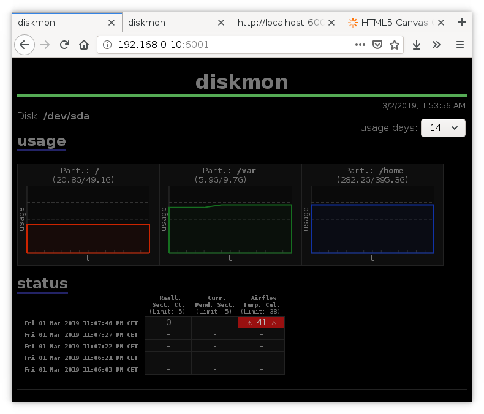

_Status: working, in use (as of Mar 2019)_

# diskmon

Small harddisk monitoring script. Providing a simple webpage overview.

Using Perl standalone webserver.

Multiple disks are supported.

Using smartctl and df.

## Usage

Configuration in MyConfig.pm

./diskmon.pl to collect data (e.g. use w/ cron, as root).

./server.pl to start the server (default port 6001).

## Motivation

Learning/using Perl CGI, Template Toolkit and JavaScript Canvas (for the graphs).
Yes, Perl in 2k19. :'D

The actual program was mostly intended for use on my Raspberry, where I have an external harddrive connected, which I use as NAS/Backup etc. I do use [Monitorix](https://www.monitorix.org/) on the Raspberry, which I really like. But Monitorix has a polling interval of one minute, which I don't want for the harddrive since I want the drive to go into standby, during day or night, when I don't use it. Smartd would be the tool for this, but it uses Mail. And that is just.. uuhm, urgh. So, that was the perfect little use-case for this project.

## Issues / Todo

### Done

- insert screenshots in readme
  ==> DONE

- create systemd file for server.pl
  ==> DONE

- make partition usage boxes wrap
  ==> DONE

- make the usage days update on refresh
  ==> DONE

- rename part.size etc.
  ==> DONE

- evtl. make n-days configurable
  ==> DONE, all props to Luca for helping me debugging this

- limit graph points to n-days (30atm.)
  ==> DONE

- limit numb. of status entries
  ==> DONE
